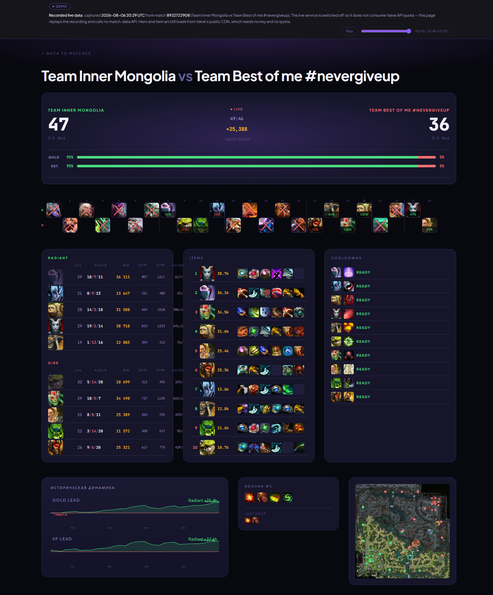
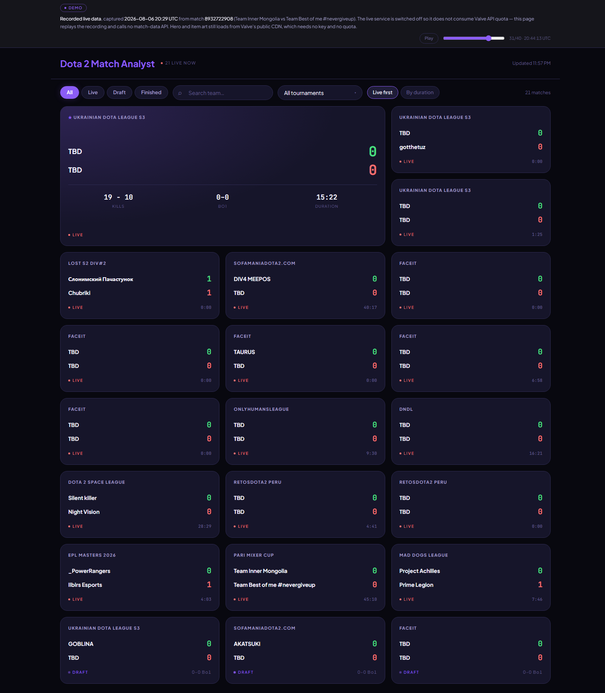
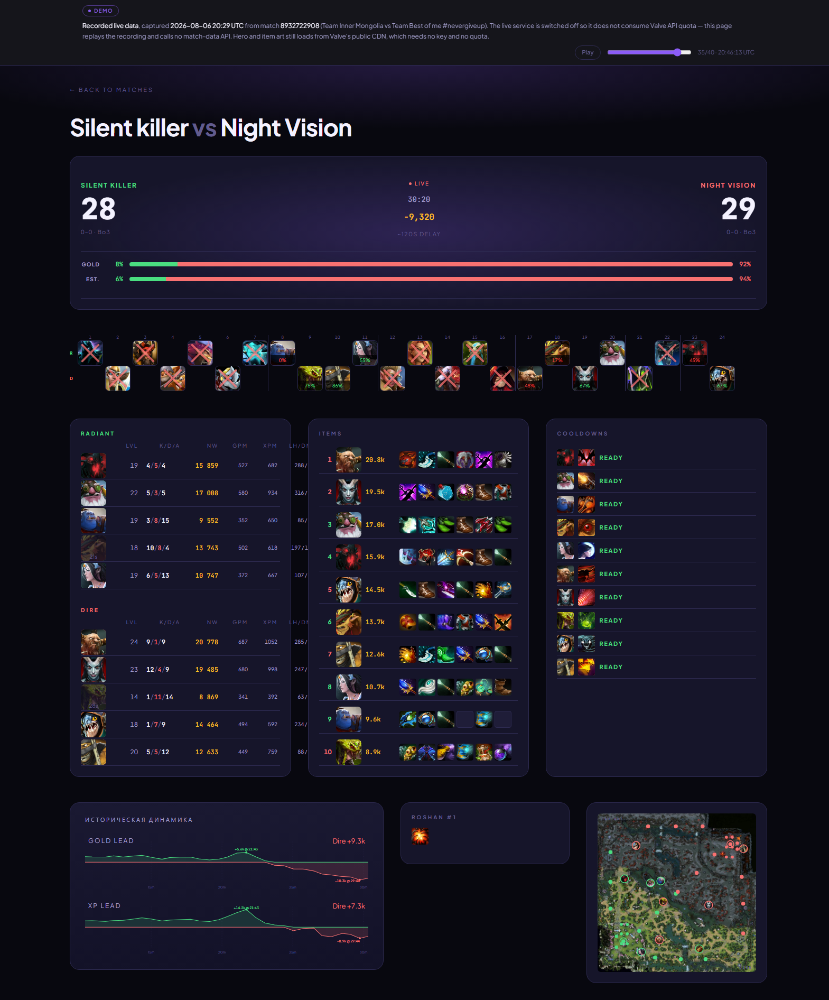

# Dota 2 Match Analyst

Real-time analytics for live Dota 2 tournament matches: draft board with per-hero win rates and
counterpick intel, live K/D/A and net worth, item and ultimate cooldown tracking, gold/XP lead
graphs, Roshan state, and hero positions on the minimap.

React 19 + Vite + TypeScript on the front, Node + Hono + Redis backend-for-frontend on the back,
fed by the Valve Web API, OpenDota and Stratz.



---

## Live demo

### → **https://shatskov-artur.github.io/dota-match-analyst/**

**The demo is a replay of a real recording, not a running service.**

It shows genuine data captured from live tournament matches on **2026-08-06, 20:29–20:48 UTC**
— 40 snapshots taken 30 seconds apart across 20+ concurrent matches. The headline match is
`8932722908`, *Team Inner Mongolia vs Team Best of me #nevergiveup* (PARI Mixer Cup), followed
from minute 28 to minute 50: the score moves 27:23 → 47:36, the gold lead grows to +25k, and
Roshan dies twice.

The live service is switched off on purpose. Running it continuously spends Valve API quota and
requires my keys to sit on a host, neither of which is worth it for a portfolio piece. So the
recording is committed to this repository and the page replays it.

An always-visible banner says so on the page itself, and a scrubber lets you drag through the
recording. Nothing about the numbers has been edited — see [Data integrity](#data-integrity).

### What the demo honestly demonstrates

- The full data pipeline working end to end on real upstream responses: Valve live-league data
  merged with OpenDota league names and hero stats, Stratz counterpick matchups, plus the
  server's own derived Roshan state and gold/XP history sampling.
- The real UI at real moments of a real match, including states that are hard to stage —
  a Roshan kill with its actual loot table, a 25k gold lead, a match transitioning out of draft.
- Client behaviour: routing, error boundaries, the bento layout, all 24 draft slots with
  win-rate badges, per-player intel tooltips.

### What the demo does NOT prove

Being straight about the limits, because a replay cannot stand in for a running system:

- **Live polling.** The recording is driven by a replay clock, not by the app's own polling. The
  cadence logic is untouched and unit-tested, but you are not watching it drive real requests.
- **Caching and rate limits.** Redis cache hits, TTL behaviour, the 429 backoff with
  `Retry-After`, and the stale-copy fallback all ran during the capture but are invisible in the
  replay.
- **Behaviour under load or concurrency.**
- **Failure paths.** Upstream 502/503 handling, Stratz being absent or rate-limited, hidden
  player profiles.
- **The deployment itself.** The split Vercel + Railway setup in [DEPLOY.md](DEPLOY.md) is not
  exercised by a static build.

### Network behaviour

The demo makes **no calls to any match-data API** — not Valve, not OpenDota, not Stratz — and
carries no API key. Every `/api/*` request is answered from bundled JSON.

Hero portraits, item icons and ability icons still load from Valve's public asset CDN
(`cdn.cloudflare.steamstatic.com`), exactly as the live app does. That host needs no key and
consumes no quota, so the "no quota spent" claim holds — but it is a third-party request and the
banner says so rather than claiming the page touches nothing.

This is verified automatically, not by eyeballing DevTools:

```bash
npm run build:demo
npm run preview:demo                                   # serves dist-demo on :4173
node scripts/verify-demo.mjs --url=http://localhost:4173/ --matchId=8932722908
```

The script drives headless Chrome over the DevTools Protocol and fails if any non-CDN external
request is made or any console error is logged. Current result: **0 API requests, 0 console
errors.**

---

## Screenshots

| | |
|---|---|
|  |  |
| Home — live matches grouped by tournament | Match detail at minute 32 |
|  |  |
| Same match at minute 50 — the replay in motion | A different match from the same recording |

---

## Building the demo

```bash
npm run build:demo          # → client/dist-demo/
```

Output is a static site. Deploy the contents of **`client/dist-demo/`** to any static host.

It uses `HashRouter` and relative asset paths, so it works from a GitHub Pages project
subdirectory with no rewrite rules. Note that it must be **served over HTTP** — opening
`index.html` straight off disk does not work, because Chrome blocks ES module loading over
`file://`. That is true of any Vite build, not something specific to this demo.

---

## Running the real thing

```bash
cp .env.example server/.env   # then fill in the values
npm install
npm run dev                   # BFF on :3001, client on :5173
```

Required in `server/.env`:

| Variable | Where to get it | Notes |
|---|---|---|
| `VALVE_API_KEY` | https://steamcommunity.com/dev/apikey | Required. Source of all live match data. |
| `UPSTASH_REDIS_URL` | console.upstash.com | Host only — `cache.ts` rebuilds the connection string. Do not append a port. |
| `UPSTASH_REDIS_TOKEN` | console.upstash.com | |
| `STRATZ_TOKEN` | https://stratz.com/api | Required at boot — see below. |

**About the Stratz token.** `server/src/env.ts` validates it at startup, so the server will not
boot without one. If the token is present but expired or rate-limited, degradation is partial:
win probability survives, because the server always computes the `gold` and `estimate` bars from
its own logistic model over the Valve scoreboard and only treats the Stratz number as optional
(`stratz: null`). Counterpick intel does not survive — hero matchups come from Stratz alone and
the tooltips go quiet.

---

## Capturing a new snapshot

```bash
npm run dev --prefix server                                    # BFF must be up
npx tsx scripts/capture-snapshot.ts --minutes=20 --interval=30
```

The script records **BFF responses**, not raw upstream ones. That is deliberate: the client never
sees raw Valve payloads, so recording upstream would force the demo to re-derive league names,
Roshan state and the history array — precisely the sort of data massaging a proof artifact must
avoid.

Targets are auto-selected (longest-running in-game match, a runner-up, and one still in draft) or
given with `--targets=id1,id2`. Pass several — matches end without warning, and one of the first
run's targets ended between selection and the first slice.

### Data integrity

- **Payloads are never edited.** Each file wraps an untouched `payload` in a metadata envelope
  recording `capturedAt`, the endpoint, which upstreams produced it, the match id and the slice
  index.
- **Nothing is substituted for missing data.** A failed request is logged and skipped. Per-match
  endpoints are only recorded for matches present in that slice's live list, because
  `/api/live/winprob/:id` answers `200` with a zeroed heuristic for a match that has already
  ended — which would have written plausible-looking files describing a game state that never
  existed.
- **Secrets are scanned for before every write**, against the literal values in `server/.env`
  plus generic key/token/URL patterns. A hit aborts the run, since `demo-data/` is committed.
  The current snapshot: 546 files, 15.2 MB, zero hits.

---

## Layout

```
client/          React 19 + Vite + Tailwind 4 + TanStack Query v5
  src/demo/      snapshot index, replay driver, disclosure banner (demo build only)
  src/lib/       apiFetch — the single seam between network and snapshot
server/          Hono BFF: routes, zod schemas, Redis cache, per-upstream queues
shared/          hero/item/building decoders used by both sides
demo-data/       the committed recording — 40 slices, the demo's evidence
scripts/         capture-snapshot, verify-demo, fetch-fonts, seed helpers
.planning/       GSD workflow artifacts
```

## Tests

```bash
npm test --prefix server    # 114 tests
npm test --prefix client    # 123 tests
```

## Notable implementation details

- Every upstream response is parsed with zod using `.passthrough()` — Valve adds fields silently
  each patch, and dropping unknown ones would lose data the UI later needs.
- A `cached()` wrapper is the only path upstream, so N concurrent viewers cost one upstream call
  per TTL. It also carries the 429 retry with `Retry-After` and a 24h stale fallback.
- Polling stops entirely on `game_state === 6`. Finished matches otherwise drain quota forever.
- Valve moves fields between the top level and `scoreboard` without warning: `game_state`,
  `duration`, `roshan_respawn_timer` and the kill score all have to be derived from both.
- Hidden profiles (`account_id === 4294967295`) short-circuit at the aggregator rather than
  failing a request.
